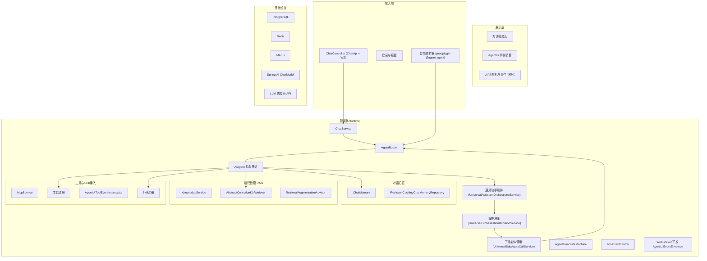
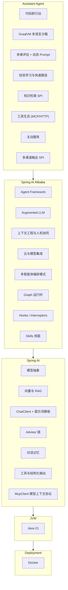
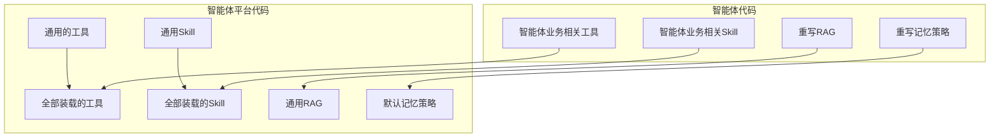

简体中文 | [English](README_en.md)

[](https://github.com/j2agent-ai/j2agent)

体验地址：[https://j2agent.aiibii.com/](https://j2agent.aiibii.com/)

J2Agent 是一个基于 Java Spring AI 的 Agent 运行平台。基于 Spring AI 与 Spring AI Alibaba，提供 Agent 推理执行、多智能体路由、RAG 检索增强、MCP / Skills 工具接入与可插拔业务 Agent 扩展，并集成 PostgreSQL、Redis、Milvus 等基础设施。

## 贡献者

<a href="https://github.com/j2agent-ai/j2agent/graphs/contributors">
  
</a>

## Docker 一键部署

Docker 配置都在 `docker/` 目录下，默认会启动 Milvus（v2.6.9）、PostgreSQL、Redis 与 J2Agent。

1. 拉取所有依赖镜像（可选）

```shell
docker pull eclipse-temurin:21-jre
docker pull docker.io/postgres:18.4
docker pull redis:7.4.2
docker pull quay.io/coreos/etcd:v3.5.25
docker pull minio/minio:RELEASE.2024-12-18T13-15-44Z
docker pull milvusdb/milvus:v2.6.17
```

2. 构建并部署前端

```shell
git clone https://github.com/j2agent-ai/j2agent-ui.git /tmp/j2agent-ui
cd /tmp/j2agent-ui && npm install && npm run build
mv dist ui
mv ui ${J2AGENT_VOLUMES_PATH}/volumes/j2agent/
```

或者直接拉取预编译产物：

```shell
git clone -b dist https://github.com/j2agent-ai/j2agent-ui.git ${J2AGENT_VOLUMES_PATH}/volumes/j2agent/ui
```

3. 部署

```shell
docker compose -f docker/docker-compose.yml up -d --build
```

默认部署只暴露 HTTP。如果需要启用 HTTPS，先生成一套本地自签证书（兼容 nginx 的 `.crt` / `.key` PEM 格式）：

```shell
docker/gen-self-signed-cert.sh
```

然后编辑 `docker/.env`：

```properties
J2AGENT_HTTPS_ENABLED=true
```

再按默认命令启动：

```shell
docker compose -f docker/docker-compose.yml up -d --build
```

HTTPS 模式不改变端口，只把 `J2AGENT_PORT` 上的访问协议从 HTTP 切换为 HTTPS。应用容器会直接启用 Spring Boot HTTPS，并从 `/opt/j2agent/volume/certs` 读取证书。自签证书会触发浏览器安全提示，生产环境请替换为可信 CA 签发的证书。

可配置项（`docker/.env`，参考 `docker/.env.example`）：

- `J2AGENT_VOLUMES_PATH`：宿主机配置/数据根目录（默认 `~/j2agent`）
- `COMPOSE_PROJECT_NAME`：容器前缀（默认 `j2agent`）
- `J2AGENT_PORT`：服务端口（默认 `30111`；HTTPS 开启后端口不变）
- `J2AGENT_HTTPS_ENABLED`：是否启用 HTTPS（默认 `false`）
- `J2AGENT_HTTPS_CERT_FILE` / `J2AGENT_HTTPS_KEY_FILE`：PEM 证书与私钥文件名，兼容 nginx 常用证书格式；宿主机目录为 `${J2AGENT_VOLUMES_PATH}/volumes/j2agent/certs`
- `TAG`：镜像标签
- `I18N`：国际化语言（如 `zh_CN` / `en_US`）

访问：

- UI：`http://localhost:30111/`（端口以 `J2AGENT_PORT` 为准）
- 健康检查：`http://localhost:30111/v1/api/j2agent/health-check`
- HTTPS UI：`https://localhost:30111/`（端口以 `J2AGENT_PORT` 为准）
- HTTPS 健康检查：`https://localhost:30111/v1/api/j2agent/health-check`

容器内访问宿主机地址：

- macOS/Windows：`host.docker.internal`
- Linux：`host.docker.internal`（需要 Docker 20.10+ 并配置 `extra_hosts: ["host.docker.internal:host-gateway"]`）

## 演示


## 架构

### 智能体平台总体框架



### 技术选型（Spring AI 栈）



### 代码边界



## 用途

开源 Agent 平台多以 Python 实现。J2Agent 面向 Java 开发者，在 Spring AI 生态内提供可运行的 Agent 底座，便于将 RAG、MCP、Skills 与业务智能体集成到现有 Java 项目中。

## 特性

- **Agent 运行时**：基于 Spring AI Alibaba `ReactAgent`；`AiAgent` 抽象封装模型、工具、Hooks 与单轮/流式编排（`ChatService`）。
- **多智能体路由**：`AgentRouter` 按 `agent-id` 分发；插件中 `extends AiAgent` 的业务 Agent 经 Spring 注入自动注册。
- **Spring AI 模型与工具**：`ChatClient`、Advisor 链、Function / Tool Calling；兼容 Ollama、OpenAI 等接口。
- **RAG 知识检索**：Milvus + `RetrievalAugmentationAdvisor`；Collection 级 `AbstractCollectionKbRetriever`，支持知识同步与命中测试。
- **MCP 工具接入**：`McpService` 外连 MCP 服务；Client 与 LLM 以 Function Calling 交互，降低 Prompt Token 消耗。
- **Skills 渐进式披露**：`SkillRegistry` + `read_skill` 按需加载 `SKILL.md`；加载过程可审计并推送 AgentUi 事件。
- **对话记忆**：可扩展 `ChatMemory` 策略；`RedissonCachingChatMemoryRepository`（Redis 缓存 + JDBC 落库）。
- **AgentUi 事件流**：WebSocket 推送 `AgentUiEventEnvelope`；`AgentTurnStateMachine`、工具调用与 Skill 加载可视化。
- **JDK 21**：虚拟线程提升并发；Docker Compose 一键部署 PostgreSQL / Redis / Milvus。

## 待完善

- **Rerank**：提供 Rerank 功能，以实现对检索结果的排序和过滤。
- 适配 MCP 协议的 Streamable HTTP 传输层（等待 Spring AI 发布 Release）。
- **知识库维护**：提供知识库管理功能，支持知识库的创建、导入、导出、删除等操作。

## 默认账号密码

aiadmin  
j2agent@2025

## 前端

[j2agent-ui](https://github.com/j2agent-ai/j2agent-ui)

## 文档

详细设计与开发文档见 [j2agent-docs](https://github.com/j2agent-ai/j2agent-docs)。
