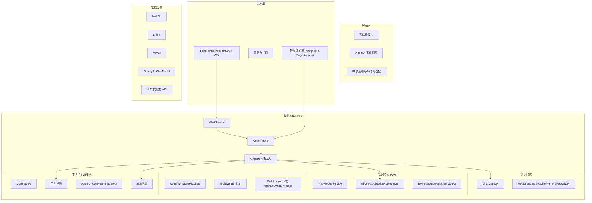
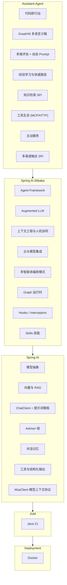
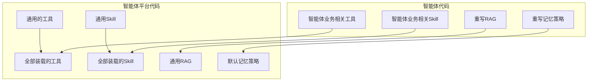

简体中文 | [English](README_en.md)

[](https://github.com/jerryt92/j2agent)

J2Agent 是一个基于 Java Spring Boot 的智能体平台，在 RAG（检索增强生成）、MCP 工具接入与 Spring AI Alibaba Agent 运行时之上，为 Java 生态提供可扩展的多智能体对话、知识检索与插件化业务能力。平台支持接入 Ollama、OpenAI 等主流大语言模型接口，并集成 Milvus 向量库、MySQL 与 Redis，提供高效的向量检索与会话记忆能力。

## 贡献者

<a href="https://github.com/jerryt92/j2agent/graphs/contributors">
  
</a>

## Docker 一键部署

Docker 配置都在 `docker/` 目录下，默认会启动 Milvus（v2.6.9）、MySQL、Redis 与 J2Agent。

1. 拉取所有依赖镜像（可选）

```shell
docker pull maven:3.8.8-amazoncorretto-21-debian
docker pull eclipse-temurin:21-jre
docker pull alpine/git
docker pull milvusdb/milvus:v2.6.9
docker pull debian:bookworm-slim
```

2. 拉取前端

```shell
rm -rf j2agent-starter/src/main/resources/dist
git clone -b dist https://github.com/jerryt92/j2agent-ui.git j2agent-starter/src/main/resources/dist
```

Windows

```shell
Remove-Item -Recurse -Force j2agent-starter\src\main\resources\dist
```

```shell
git clone -b dist https://github.com/jerryt92/j2agent-ui.git j2agent-starter\src\main\resources\dist
```

3. 部署

```shell
docker compose -f docker/docker-compose.yml up -d --build
```

可配置项（`docker/.env`，参考 `docker/.env.example`）：

- `J2AGENT_BASE_PATH`：宿主机配置/数据根目录（默认 `~/j2agent`）
- `COMPOSE_PROJECT_NAME`：容器前缀（默认 `j2agent`）
- `J2AGENT_PORT`：服务端口（默认 `30111`）
- `TAG`：镜像标签
- `I18N`：国际化语言（如 `zh_CN` / `en_US`）

访问：

- UI：`http://localhost:30111/`（端口以 `J2AGENT_PORT` 为准）
- 健康检查：`http://localhost:30111/v1/api/j2agent/health-check`

容器内访问宿主机地址：

- macOS/Windows：`host.docker.internal`
- Linux：`host.docker.internal`（需要 Docker 20.10+ 并配置 `extra_hosts: ["host.docker.internal:host-gateway"]`）

## 演示


## 架构

### 智能体平台总体框架



### 技术选型（Spring AI 栈）



### 代码边界



## 用途

目前为止开源的智能体 / RAG 平台中，很多由 Python 实现。作为 Java 开发者，希望 J2Agent 更适合 Java 技术栈，提供 Agent 运行时、RAG、MCP 与可插拔业务智能体的一体化集成。

## 特性

- **多模型支持**：兼容 Ollama 和 OpenAI 风格接口，灵活切换不同的大语言模型。
- **向量数据库集成**：支持 Milvus 向量数据库，满足不同场景下的性能需求。
- **Agent 运行时**：基于 Spring AI Alibaba `ReactAgent`，支持 `AiAgent` 抽象与 `AgentRouter` 多智能体路由。
- **Function Calling**：支持函数调用，让 LLM 能够调用其他系统的 API。
- **MCP 支持**：支持 MCP（模型上下文协议），实现模型工具调用的标准化。
- MCP Client 与 LLM 交互使用 Function Calling 技术，而不是 Prompt，节约 Token 消耗。
- **Skills 渐进式披露**：通过 `read_skill` 与 `SkillRegistry` 按需加载技能文档。
- **AgentUi 事件流**：WebSocket 下发 `AgentUiEventEnvelope`，支持工具调用与状态机可视化。
- **Java 生态优化**：专为 Java 开发者设计，简化智能体技术在 Java 项目中的集成与应用。
- **JDK 21**：J2Agent 基于 JDK 21 开发，可使用虚拟线程，提升并发性能。
- **知识维护**：提供知识库管理功能，支持知识库知识的增加、修改、删除和命中测试等操作。

## 界面

界面风格灵动，采用毛玻璃风格，支持暗色模式。


## 知识维护


## 待完善

- **Rerank**：提供 Rerank 功能，以实现对检索结果的排序和过滤。
- 适配 MCP 协议的 Streamable HTTP 传输层（等待 Spring AI 发布 Release）。
- **知识库维护**：提供知识库管理功能，支持知识库的创建、导入、导出、删除等操作。

## 默认账号密码

admin  
j2agent@2025

## 前端

[j2agent-ui](https://github.com/jerryt92/j2agent-ui)
