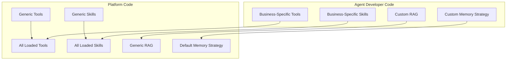

[简体中文](README.md) | English

[](https://github.com/j2agent-ai/j2agent)

J2Agent is an Agent runtime platform built on Java Spring AI. Powered by Spring AI and Spring AI Alibaba, it provides agent execution, multi-agent routing, RAG retrieval augmentation, MCP / Skills tool integration, pluggable business agents, and infrastructure integration with PostgreSQL, Redis, and Milvus.

## Contributors

<a href="https://github.com/j2agent-ai/j2agent/graphs/contributors">
  
</a>

## One-Click Deployment with Docker

All Docker configurations are located in the `docker/` directory. By default, it starts Milvus (v2.6.9), PostgreSQL, Redis, and J2Agent.

1. Pull all dependency images (optional)

```shell
docker pull eclipse-temurin:21-jre
docker pull docker.io/postgres:18.4
docker pull redis:7.4.2
docker pull quay.io/coreos/etcd:v3.5.25
docker pull minio/minio:RELEASE.2024-12-18T13-15-44Z
docker pull milvusdb/milvus:v2.6.17
```

2. Build and deploy frontend

```shell
git clone https://github.com/j2agent-ai/j2agent-ui.git /tmp/j2agent-ui
cd /tmp/j2agent-ui && npm install && npm run build
mv dist ui
mv ui ${J2AGENT_VOLUMES_PATH}/volumes/j2agent/
```

Or pull pre-built artifacts directly:

```shell
git clone -b dist https://github.com/j2agent-ai/j2agent-ui.git ${J2AGENT_VOLUMES_PATH}/volumes/j2agent/ui
```

3. Deploy

```shell
docker compose -f docker/docker-compose.yml up -d --build
```

Configurable options (`docker/.env`, see `docker/.env.example`):

- `J2AGENT_VOLUMES_PATH`: Host configuration/data root directory (default `~/j2agent`)
- `COMPOSE_PROJECT_NAME`: Container prefix (default `j2agent`)
- `J2AGENT_PORT`: Service port (default `30111`)
- `TAG`: Image tag
- `I18N`: Locale (e.g. `zh_CN` / `en_US`)

Access:

- UI: `http://localhost:30111/` (port follows `J2AGENT_PORT`)
- Health check: `http://localhost:30111/v1/api/j2agent/health-check`

Host access within containers:

- macOS/Windows: `host.docker.internal`
- Linux: `host.docker.internal` (requires Docker 20.10+ and `extra_hosts: ["host.docker.internal:host-gateway"]`)

## Demo


## Architecture

### Platform Overview


### Technology Stack (Spring AI)

```mermaid
graph TD
    subgraph assistant ["Assistant Agent"]
        aa1["Code-as-Action"]
        aa2["GraalVM Multi-Language Sandbox"]
        aa3["Multi-Dimensional Evaluation + Dynamic Prompt"]
        aa4["Experience Learning & Fast Path"]
        aa5["Knowledge Retrieval SPI"]
        aa6["Tool Ecosystem (MCP/HTTP)"]
        aa7["Proactive Services"]
        aa8["Multi-Channel SPI"]
    end

    subgraph saia ["Spring AI Alibaba"]
        saia1["Agent Framework"]
        saia2["Augmented LLM"]
        saia3["Context Engineering & Human-in-the-Loop"]
        saia4["Cloud & Model Integration"]
        saia5["Multi-Agent Orchestration"]
        saia6["Graph Runtime"]
        saia7["Hooks / Interceptors"]
        saia8["Skills"]
    end

    subgraph sai ["Spring AI"]
        sai1["Model Abstraction"]
        sai2["Vector Store & RAG"]
        sai3["ChatClient + Prompt Templates"]
        sai4["Advisor Chain"]
        sai5["Chat Memory"]
        sai6["Tools & Structured Output"]
        sai7["McpClient Protocol"]
    end

    subgraph jvm ["JVM"]
        java21["Java 21"]
    end

    subgraph deploy ["Deployment"]
        dockerNode["Docker"]
    end

    assistant --> saia
    saia --> sai
    sai --> jvm
    jvm --> deploy
```



### Code Boundaries



## Purpose

Most open-source Agent platforms are Python-based. J2Agent targets Java developers with a runnable Agent foundation on Spring AI, making it straightforward to integrate RAG, MCP, Skills, and business agents into existing Java projects.

## Features

- **Agent runtime**: Spring AI Alibaba `ReactAgent`; `AiAgent` abstraction for models, tools, hooks, and single-turn/stream orchestration (`ChatService`).
- **Multi-agent routing**: `AgentRouter` dispatches by `agent-id`; business agents (`extends AiAgent`) auto-register via Spring injection in plugins.
- **Spring AI models & tools**: `ChatClient`, Advisor chain, Function / Tool Calling; compatible with Ollama, OpenAI-style APIs, and more.
- **RAG retrieval**: Milvus + `RetrievalAugmentationAdvisor`; per-collection `AbstractCollectionKbRetriever` with sync and hit testing.
- **MCP integration**: `McpService` connects external MCP servers; clients interact with LLMs via Function Calling to reduce prompt token usage.
- **Skills progressive disclosure**: `SkillRegistry` + `read_skill` loads `SKILL.md` on demand; load events are auditable and pushed to AgentUi.
- **Conversation memory**: Extensible `ChatMemory`; `RedissonCachingChatMemoryRepository` (Redis cache + JDBC persistence).
- **AgentUi event stream**: WebSocket `AgentUiEventEnvelope`; `AgentTurnStateMachine`, tool calls, and skill loading visualization.
- **JDK 21**: Virtual threads for concurrency; Docker Compose for PostgreSQL / Redis / Milvus.

## To Be Improved

- **Rerank**: Reranking for retrieval results.
- Streamable HTTP transport for MCP (awaiting Spring AI release).
- **Knowledge base maintenance**: Create, import, export, and delete knowledge bases.

## Default Account Credentials

aiadmin  
j2agent@2025

## Frontend

[j2agent-ui](https://github.com/j2agent-ai/j2agent-ui)
