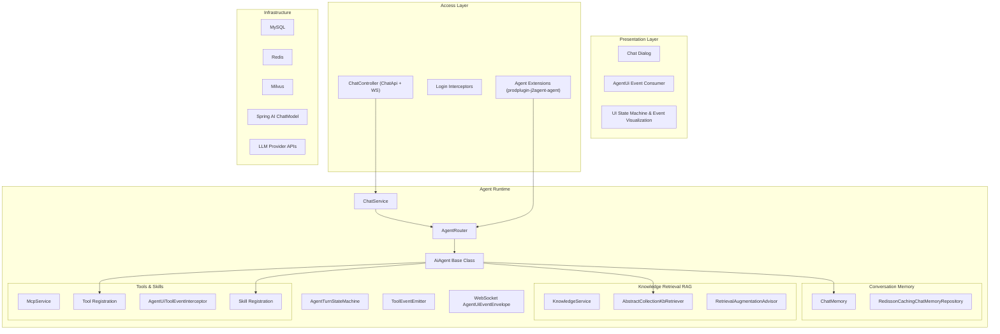
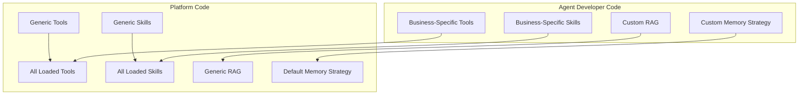

[简体中文](README.md) | English

[](https://github.com/jerryt92/j2agent)

J2Agent is an agent platform based on Java Spring Boot. Built on RAG (Retrieval-Augmented Generation), MCP tool integration, and the Spring AI Alibaba Agent runtime, it provides extensible multi-agent chat, knowledge retrieval, and pluggable business agents for the Java ecosystem. The platform supports mainstream LLM APIs such as Ollama and OpenAI, and integrates Milvus, MySQL, and Redis for vector search and conversational memory.

## Contributors

<a href="https://github.com/jerryt92/j2agent/graphs/contributors">
  
</a>

## One-Click Deployment with Docker

All Docker configurations are located in the `docker/` directory. By default, it starts Milvus (v2.6.9), MySQL, Redis, and J2Agent.

1. Pull all dependency images (optional)

```shell
docker pull maven:3.8.8-amazoncorretto-21-debian
docker pull eclipse-temurin:21-jre
docker pull alpine/git
docker pull milvusdb/milvus:v2.6.9
docker pull debian:bookworm-slim
```

2. Pull frontend

```shell
rm -rf j2agent-starter/src/main/resources/dist
git clone -b dist https://github.com/jerryt92/j2agent-ui.git j2agent-starter/src/main/resources/dist
```

Windows

```shell
Remove-Item -Recurse -Force j2agent-starter\src\main\resources\dist
```

```shell
git clone -b dist https://github.com/jerryt92/j2agent-ui.git j2agent-starter\src\main\resources\dist
```

3. Deploy

```shell
docker compose -f docker/docker-compose.yml up -d --build
```

Configurable options (`docker/.env`, see `docker/.env.example`):

- `J2AGENT_BASE_PATH`: Host configuration/data root directory (default `~/j2agent`)
- `COMPOSE_PROJECT_NAME`: Container prefix (default `j2agent`)
- `J2AGENT_PORT`: Service port (default `30111`)
- `TAG`: Image tag
- `I18N`: Locale (e.g. `zh_CN` / `en_US`)

Access:

- UI: `http://localhost:30111/` (port follows `J2AGENT_PORT`)
- Health check: `http://localhost:30111/v1/api/j2agent/health-check`

Host access within containers:

- macOS/Windows: `host.docker.internal`
- Linux: `host.docker.internal` (requires Docker 20.10+ and `extra_hosts: ["host.docker.internal:host-gateway"]`)

## Demo


## Architecture

### Platform Overview



### Technology Stack (Spring AI)

```mermaid
graph TD
    subgraph assistant ["Assistant Agent"]
        aa1["Code-as-Action"]
        aa2["GraalVM Multi-Language Sandbox"]
        aa3["Multi-Dimensional Evaluation + Dynamic Prompt"]
        aa4["Experience Learning & Fast Path"]
        aa5["Knowledge Retrieval SPI"]
        aa6["Tool Ecosystem (MCP/HTTP)"]
        aa7["Proactive Services"]
        aa8["Multi-Channel SPI"]
    end

    subgraph saia ["Spring AI Alibaba"]
        saia1["Agent Framework"]
        saia2["Augmented LLM"]
        saia3["Context Engineering & Human-in-the-Loop"]
        saia4["Cloud & Model Integration"]
        saia5["Multi-Agent Orchestration"]
        saia6["Graph Runtime"]
        saia7["Hooks / Interceptors"]
        saia8["Skills"]
    end

    subgraph sai ["Spring AI"]
        sai1["Model Abstraction"]
        sai2["Vector Store & RAG"]
        sai3["ChatClient + Prompt Templates"]
        sai4["Advisor Chain"]
        sai5["Chat Memory"]
        sai6["Tools & Structured Output"]
        sai7["McpClient Protocol"]
    end

    subgraph jvm ["JVM"]
        java21["Java 21"]
    end

    subgraph deploy ["Deployment"]
        dockerNode["Docker"]
    end

    assistant --> saia
    saia --> sai
    sai --> jvm
    jvm --> deploy
```



### Code Boundaries



## Purpose

Many open-source agent / RAG platforms are implemented in Python. As a Java developer, J2Agent aims to provide Agent runtime, RAG, MCP, and pluggable business agents in one Java-native stack.

## Features

- **Multi-model support**: Compatible with Ollama and OpenAI-style interfaces.
- **Vector database integration**: Supports Milvus for various performance scenarios.
- **Agent runtime**: Spring AI Alibaba `ReactAgent` with `AiAgent` abstraction and `AgentRouter` multi-agent routing.
- **Function Calling**: Enables LLMs to call APIs from other systems.
- **MCP support**: Model Context Protocol for standardized tool invocation.
- MCP Client interacts with LLM via Function Calling instead of prompts to save tokens.
- **Skills progressive disclosure**: Load skill docs on demand via `read_skill` and `SkillRegistry`.
- **AgentUi event stream**: WebSocket `AgentUiEventEnvelope` for tool calls and state machine visualization.
- **Java ecosystem optimization**: Designed for Java developers integrating agent capabilities.
- **JDK 21**: Virtual threads for improved concurrency.
- **Knowledge management**: Knowledge base CRUD and hit testing.

## Interface

Dynamic frosted-glass UI with dark mode support.


## Knowledge Management


## To Be Improved

- **Rerank**: Reranking for retrieval results.
- Streamable HTTP transport for MCP (awaiting Spring AI release).
- **Knowledge base maintenance**: Create, import, export, and delete knowledge bases.

## Default Account Credentials

admin  
j2agent@2025

## Frontend

[j2agent-ui](https://github.com/jerryt92/j2agent-ui)
