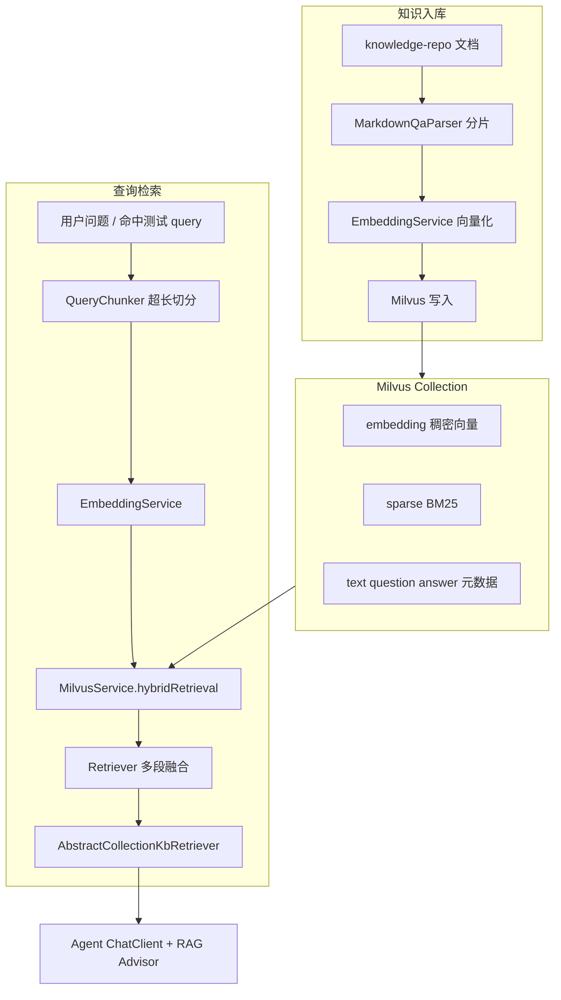

# RAG 机制

本文档目录描述智能体平台的 **检索增强生成（RAG）** 全链路：知识库入库、向量存储、混合检索、超长查询融合，以及静态资源展示。

## 总体架构



## 文档索引

| 文档 | 说明 |
|------|------|
| [知识库同步](知识库同步.md) | `knowledge-repo` 目录约定、`info.json`、分片规则、增量同步与 Milvus Schema |
| [融合检索](融合检索.md) | 稠密 + 稀疏混合检索、超长 query 多向量切分与结果融合 |
| [静态文件展示机制](静态文件展示机制.md) | 图片等静态资源 URL 改写与 `FileController` 直链 |

## 代码入口（速查）

| 模块 | 路径 |
|------|------|
| 检索引擎 | `j2agent-server/.../service/rag/retrieval/Retriever.java` |
| 查询切分 | `.../service/rag/retrieval/QueryChunker.java` |
| Milvus 混合检索 | `.../service/rag/vdb/milvus/MilvusService.java` |
| 对话侧 DocumentRetriever | `.../rag/AbstractCollectionKbRetriever.java` |
| 知识库同步 | `.../service/rag/knowledge/repo/KnowledgeRepoSyncService.java` |
| 向量写入 | `.../service/rag/knowledge/MilvusKnowledgeWriteService.java` |

## 相关配置

```yaml
com:
  nms:
    ai:
      knowledge:
        repo:
          root-path: /opt/j2agent/volume/knowledge-repo
          watch-enabled: true
      retrieve:
        max-embedding-input-chars: 7500
        query-chunk-overlap-chars: 200
        max-query-chunks: 4
```

Embedding 提供商连接（`baseUrl`、`embeddingsPath`）见 [LLM 提供商配置](../LLM提供商配置/README.md)。对话记忆与 `conversationId` 见 [Agent 对话记录机制](../agent对话记录/README.md)。
