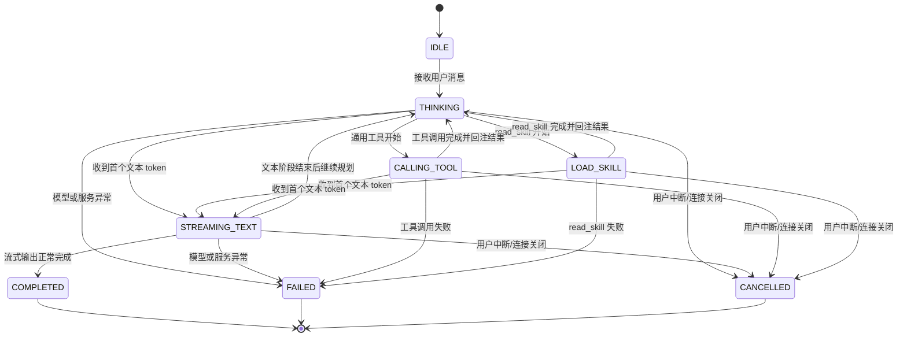

# Agent-UI 交互机制（状态机优先）

## 1. 目标

- 以 `AgentState` 状态迁移为第一驱动，避免 UI 直接耦合 LLM 原始 token。
- 通过统一事件信封 `AgentUiEventEnvelope` 传递对话过程，支撑文本、工具调用等多类型消息。
- 保证单轮会话（turn）“单终态”收敛：`COMPLETED | FAILED | CANCELLED` 三选一。

## 2. 状态机定义

### 2.1 状态集合

- `IDLE`：未开始。
- `THINKING`：模型思考中。
- `STREAMING_TEXT`：输出文本中。
- `CALLING_TOOL`：通用工具调用中。
- `LOAD_SKILL`：正在执行官方 `read_skill` 加载技能正文（与 `CALLING_TOOL` 平行，独立计数；若两者计数同时非零，以状态机当前 `state` 为准）。
- `COMPLETED`：成功结束。
- `FAILED`：失败结束。
- `CANCELLED`：中断结束。

### 2.2 迁移规则

- `IDLE -> THINKING`：接收用户消息。
- `THINKING -> STREAMING_TEXT`：收到首个文本 token。
- `THINKING -> CALLING_TOOL`：检测到非 `read_skill` 的工具调用开始。
- `THINKING -> LOAD_SKILL`：检测到 `read_skill` 开始（由 `ToolEventEmitter#onSkillLoadStart` 驱动）。
- `CALLING_TOOL -> THINKING`：最后一项并发工具结束。
- `LOAD_SKILL -> THINKING`：最后一项并发 `read_skill` 结束。
- `LOAD_SKILL -> STREAMING_TEXT`：在仍处于 `LOAD_SKILL` 时收到首个文本 token（与自 `CALLING_TOOL` 进入文本阶段一致）。
- `STREAMING_TEXT -> COMPLETED`：流式输出正常完成。
- `THINKING/STREAMING_TEXT -> FAILED`：模型或服务异常。
- `THINKING/STREAMING_TEXT/CALLING_TOOL/LOAD_SKILL -> CANCELLED`：用户中断或连接关闭。

### 2.3 运行时扩展状态机图



## 3. 事件协议

### 3.1 Envelope 字段

- `eventId`：事件唯一 ID。
- `contextId`：会话 ID。
- `turnId`：轮次 ID。
- `seq`：轮次内递增序号。
- `state`：当前状态。
- `transition`：状态迁移 `{from,to,reason}`。
- `phase`：`START | DELTA | PATCH | COMPLETE | ERROR`。
- `eventType`：`MESSAGE | TOOL | PROGRESS | NOTICE | SYSTEM`。
- `payload`：事件数据（判别联合）。
- `ts`：事件时间戳。

### 3.2 payload 判别联合

- `eventType=MESSAGE`：承载文本流式数据（目前复用 `ChatResponseDto`）。
- `eventType=TOOL`：工具调用生命周期数据；`read_skill` 同样使用该类型，但状态机处于 `LOAD_SKILL`，载荷中可带 `skillName` 供 UI 展示。
- `eventType=SYSTEM/NOTICE`：状态提示与诊断信息。

### 3.3 回合成功结束后的「建议追问」（`eventType=NOTICE`）

- **触发时机**：本轮流式正常结束，服务端已发出 `COMPLETED` + `SYSTEM`（`payload.notice=completed`）之后、关闭 WebSocket 之前，可再追加**一条**可选事件。
- **信封约定**：
  - `state`：`COMPLETED`
  - `phase`：`COMPLETE`
  - `eventType`：`NOTICE`
  - `payload`：`{ "notice": "suggested-follow-ups", "items": ["...", "..."] }`（`items` 为 3～5 条用户可点击发送的短句；无结果或生成失败时**不发送**该事件）。
- **顺序**：`COMPLETED/SYSTEM/completed` → `COMPLETED/NOTICE/suggested-follow-ups`（可选）→ 关闭连接。
- **前端**：由 `useAgentEventDispatcher` 解析 `items` 写入独立状态，在聊天输入框上方展示快捷选项；**不**写入 `MessageDto` 气泡列表（与 `agentRendererRegistry` 中 `COMPLETED:NOTICE` → `ignore` 对齐）。

### 3.4 `read_skill` 与 `LOAD_SKILL`（`eventType=TOOL`）

Spring AI Alibaba 通过 Skills Hook 注册 `read_skill` 实现技能渐进式披露（参见 [Skills 技能](https://java2ai.com/docs/frameworks/agent-framework/tutorials/skills)）。本工程使用 `AgentSkillsAgentHook` + `AgentReadSkillTool` 替代默认实现：仍为单一工具名 `read_skill`，可选参数 `relative_path` 读取技能目录内附属 `.md`（`AgentClassLoaderSkillRegistry#readSkillResourceContent`）。UI 加载态为 `LOAD_SKILL`。约定：

- **不再**使用 `NOTICE` + `payload.notice=skill-load` 驱动主界面 busy/轨迹；改为状态机状态 `LOAD_SKILL` + `eventType=TOOL` 与通用工具一致的生命周期（`START` / `DELTA`+`COMPLETE` / `ERROR`）。与 3.3 中「建议追问」的 `NOTICE` 语义不同，二者以 `payload.notice` 区分。
- `ToolCallEventPayload` 在 `read_skill` 场景下可设置 `skillName`（解析自工具入参 `skillName` / `skill_name`），与 `toolName`（固定为 `read_skill`）并存；前端轨迹括号内优先展示 `skillName`。
- `AgentUiToolEventInterceptor` 对 `read_skill` **不**调用 `onToolStart/onToolSuccess/onToolFailure`，避免与 `LOAD_SKILL` 双轨。
- `AgentUiSkillLoadToolInterceptor` 在 `handler.call` 前后调用 `ToolEventEmitter#onSkillLoadStart/onSkillLoadSuccess/onSkillLoadFailure`。

审计入库：成功或失败后，由 `AgentUiSkillLoadToolInterceptor` 调用 `ChatMemory.add` 写入一条 `kind=skill_load_audit` 的 assistant 持久化 JSON 至 `chat_context_item`；该条在解码为 Spring AI 消息时会被跳过（不进入模型上下文），历史列表展示层亦隐藏。

### 3.4.1 回合状态轨迹（`turn_trace`）

- **触发时机**：单轮进入终态（`COMPLETED` / `FAILED` / `CANCELLED`）且 WebSocket 收尾前，由 `ChatService` 写入一条隐藏 assistant 行。
- **content JSON**：`{ v:1, kind:"turn_trace", turnId, steps:[{ state, toolName?, ts? }, ...] }`；`meta_json`：`{ displayInChat:false, kind:"turn_trace" }`。
- **历史 API**：`Translator.translateToChatContextDto` 解析 `turn_trace` 并回填至最近一条可见 assistant 的 `MessageDto.turnSteps`；该行本身不返回给前端消息列表。
- **前端**：`AgentTurnTimeline` 组件渲染步骤列表；实时与历史共用 `turnSteps` 字段。

### 3.5 整轮失败（`FAILED` + `SYSTEM` + `ERROR`）

- **触发时机**：导致本轮无法继续的错误，例如：
  - LLM / 流式提供方异常（`errorCode=providerError`）
  - 非法或缺失 `agent-id`、`context-id`（握手阶段：`agent_id_not_found`、`context_id_not_found`）
  - 未登录或会话缺失（`sessionMissing`）
  - 用户无权访问 `contextId`（`contextAccessDenied`）
  - 不支持的 `agentId`（`unsupportedAgent`）
  - 请求无用户消息、消息列表为空等（`emptyMessages`、`noUserMessage`）
  - 其它未分类服务端错误（`internalError`）
- **信封约定**：
  - `state`：`FAILED`
  - `phase`：`ERROR`
  - `eventType`：`SYSTEM`
  - `transition.reason`：与 `payload.errorCode` 相同
- **payload 示例**：

```json
{
  "error": true,
  "errorCode": "providerError",
  "errorMessage": "Connection reset"
}
```

- **与工具错误的区别**：可恢复的工具/MCP 调用失败仍为 `eventType=TOOL` + `phase=ERROR`，状态机回到 `THINKING`，**不**发送整轮 `FAILED`。
- **连接生命周期**：下发 `FAILED` 事件后，服务端会关闭当前 WebSocket（与成功路径 `COMPLETED` 后关连一致）。
- **前端**：`useAgentEventDispatcher` 收到 `state=FAILED` 后退出 busy；优先按 `errorCode` 做 i18n，`errorMessage` 作兜底展示。

### 3.6 热门问题模板（qa-template）

- **资源位置**：各 Agent 插件 JAR 的 `src/main/resources/qa-template.json`（`zh_CN` / `en_US` 字符串数组，格式与历史全局文件一致）。
- **显式开关**：`AiAgent#isQaTemplateEnabled()` 默认 `false`；子类返回 `true` 时列表接口透出 `showHotQuestions=true`，且允许按 Agent 返回模板数据。
- **HTTP**：
  - `GET /v1/rest/j2agent/agents` → `AgentInfoDto.showHotQuestions`
  - `GET /v1/rest/j2agent/qa-template?agent-id=&limit=` → 从对应 Agent 的 ClassLoader 读取 `qa-template.json`，随机抽取 `limit` 条；未开启或无资源时返回空 `data`。
- **前端**：`AIAssistantPage` 根据当前 `agent-id` 在 agents 列表中解析 `showHotQuestions`，传给 `ChatView`；空会话时在输入区上方展示热门问题区块，「换一换」重新请求同一 Agent 的模板；**不**写入 `MessageDto` 气泡列表。

## 4. 前端职责边界

- `useAgentEventDispatcher`：状态迁移校验 + 事件分发。
- `agentRendererRegistry`：`state + eventType -> rendererKey` 映射。
- `ChatView.vue`：仅负责输入、布局、滚动与基础展示，不直接解析底层协议；「建议追问」选项由分发器暴露的列表绑定，展示在输入框上方；「热门问题」由 `showHotQuestions` + `GET /qa-template?agent-id=` 驱动，展示在空会话欢迎区。
- 状态历史展示约定：
  - 实时轮次：`useAgentEventDispatcher` 将**完整 8 态迁移链**（`IDLE` 起点 → busy 段 → `COMPLETED`/`FAILED`/`CANCELLED` 终态）写入当前轮 assistant 尾消息的 `MessageDto.turnSteps`，由 `AgentTurnTimeline` 在气泡内以可折叠时间线展示。
  - 历史回放：`GET /context` 返回的 assistant 消息携带 `turnSteps`（由后端 `turn_trace` 审计行合并回填）；旧会话无该字段时不展示时间线。
  - 事件优先按 `transition.from -> transition.to` 追加；工具/技能结束迁回 `THINKING` 时跳过重复的 `transition.from`（与裸「加载技能」节点去重一致）。
  - 手动中断或连接关闭时，前端会补写 `CANCELLED` 终态并冻结该轮轨迹。
  - 时间线默认收起；折叠头纵向展示最近两步（每步左侧圆点：已完成实心、进行中加载圆环）；展开后显示完整 8 态链且隐藏折叠缩略头；输入框上方不再展示 `状态1 -> 状态2` 文本链。
- UI 动效约定：
  - `THINKING`、`CALLING_TOOL`、`LOAD_SKILL`：收到该状态后（含首轮 SYSTEM，如 `turn-started`），分发器会在列表末尾插入空 assistant 占位，最后一条 assistant 头像显示旋转动画。
  - `STREAMING_TEXT`：在同一 assistant 气泡内追加增量文本，不显示 THINKING 旋转动画。
- Busy 约定：
  - 非终态 `THINKING/STREAMING_TEXT/CALLING_TOOL/LOAD_SKILL` 统一视为 busy。
  - 终态 `COMPLETED/FAILED/CANCELLED` 退出 busy，恢复输入与历史操作交互。
- **Provider 深度思考 vs 最终回答**（`MessageDto.reasoningContent` + `content`）：
  - **语义**：`content` 为面向用户的最终回答；`reasoningContent` 为模型深度思考 token，与 ReAct 工具前规划文本、`assistant_tool.text` 无关。
  - **metadata 适配层**：`SpringAiReasoningMetadataAdapter` 将 Spring AI 各 ChatModel 的异构 metadata（见 [LLM 提供商配置 §1.3](../LLM提供商配置/README.md)）统一适配为 `reasoningContent`；`AssistantMessageReasoningExtractor` 在其上完成流式 tracker / XML chunk 切分并输出 DTO 双字段。
  - **实时双通道**：`ChatService` 从流式 chunk 分别提取 `answerDelta` 与 `reasoningDelta`，经 `MESSAGE/DELTA` 写入 `MessageDto.content` / `MessageDto.reasoningContent`；**仅 answer delta** 触发 `THINKING|CALLING_TOOL|LOAD_SKILL → STREAMING_TEXT`；纯 reasoning delta 保持 `THINKING`。
  - **UI**：`AgentThinkingBlock` 绑定 `reasoningContent`，默认半折叠、预览区可滚动并随流式自动滚底；`AgentTurnTimeline` 仍只展示状态机步骤。
  - **历史回放**：`ChatMemoryMessageCodec` 将 `reasoningContent` 写入 assistant 行 `meta_json`；`Translator` 回填至 `MessageDto.reasoningContent`。
  - **中断补偿**：WebSocket 关闭或流错误时，`ChatService#flushPartialAssistantOnInterrupt` 将已推送但未经 Advisor `after()` 落库的 `content` / `reasoningContent` 一并补偿写入记忆（纯思考阶段中断亦保留 `reasoningContent`）；详见 [Agent 对话记录机制 §8](../agent对话记录/README.md)。
  - **复制/反馈**：仅针对 `content`（最终回答）。

## 5. 后端职责边界

- `ChatService`：
  - 使用 `AgentTurnStateMachine` 驱动状态迁移；
  - 使用 `AgentEventBuilder` 统一构建 envelope；
  - 包装 `responseCall` 经 `TurnStepRecorder` 录制步骤；回合终态（`COMPLETED` / `FAILED` / `CANCELLED`）时将 `turn_trace` 审计行 append 至 `ChatMemory`（不参与 LLM 回放）；
  - 将流式 token、完成、异常、中断统一转换为状态机事件；首 token 进入 `STREAMING_TEXT` 时允许当前状态为 `THINKING`、`CALLING_TOOL` 或 `LOAD_SKILL`。
  - 中断时通过 `flushPartialAssistantOnInterrupt` 补偿落库已流式输出的 `content` 与 `reasoningContent`（深度思考双通道）。
- `ChatController`：
  - 负责 websocket 生命周期；
  - 仅转发 envelope 事件；
  - 连接建立后直接进入状态机事件通道，不依赖额外协议参数。
- `AssistantReactAgent`：通过 Alibaba Agent 的 `ToolInterceptor`（`AgentUiToolEventInterceptor`）在工具执行链上发射 `TOOL` 事件；单轮的 `ToolEventEmitter` 经 `RunnableConfig.context` 注入，与 `ChatService` 侧状态机一致。
- `AiAgent`：在每轮 `stream` 时向 `RunnableConfig.context` 写入 `AgentRunnableContextKeys.CONTEXT_KEY_CHAT_CONVERSATION_ID`（复合 `conversationId`），供工具拦截器落库与上下文关联。
- `IntelligentReportAgent`（等挂载官方 Skills 的 Agent）：在 `ReactAgent` 上注册 `SkillsAgentHook` 的同时，按顺序注册 `AgentUiSkillLoadToolInterceptor` 与 `AgentUiToolEventInterceptor`。外层在 `read_skill` 上驱动 `LOAD_SKILL` + `TOOL` 事件并写审计；内层对 `read_skill` 跳过 `CALLING_TOOL` 的 TOOL 计数，其它工具照常发射。

## 6. 版本迁移策略

- 统一使用当前状态机事件协议，不再通过 query 参数区分版本。
- 若后续出现协议升级，建议通过独立 endpoint 或握手能力声明实现灰度迁移。
