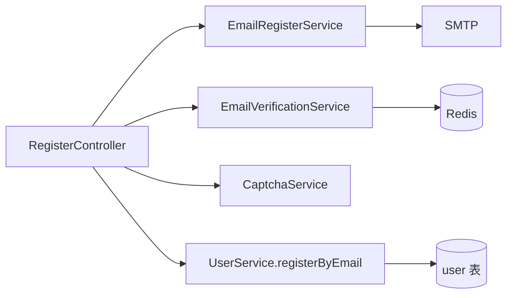
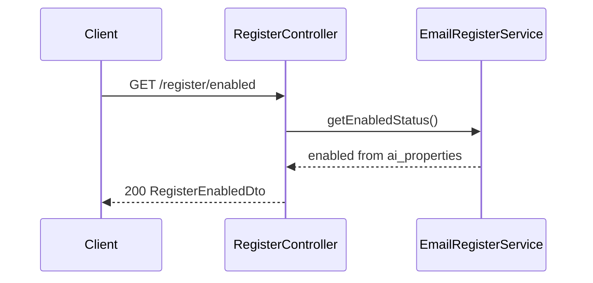
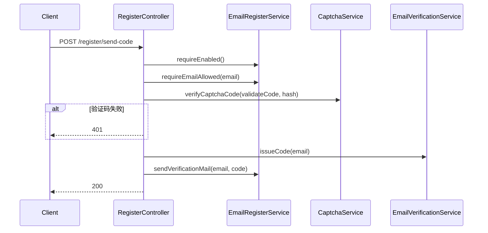
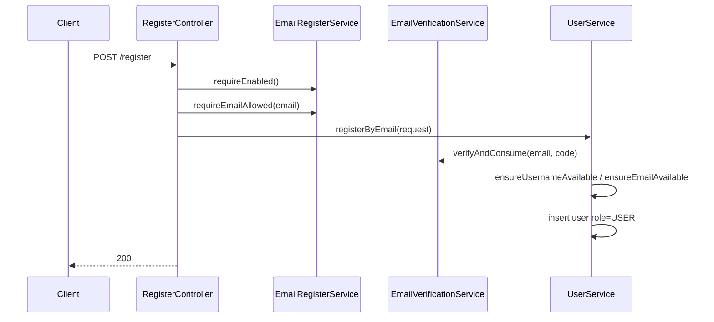

# 邮箱注册机制

本文档归档 **j2agent** 当前邮箱自助注册的实现：开关、白名单、验证码、SMTP 发信与落库规则。用户表结构、登录与会话见 [用户权限.md](./用户权限.md)。

## 概述

邮箱自助注册提供三类公开能力（无需登录）：

| 能力 | HTTP | 说明 |
|------|------|------|
| 查询开关 | `GET /v1/auth/j2agent/register/enabled` | 返回 `{ "enabled": boolean }`，不受「注册已关闭」限制 |
| 发送验证码 | `POST /v1/auth/j2agent/register/send-code` | 需注册已开启、通过白名单（若启用）、滑动验证码 |
| 提交注册 | `POST /v1/auth/j2agent/register` | 邮箱 + 密码 + 验证码，可选自定义用户名 |

- **默认关闭**：Flyway 迁移 [`V0_1__init_data.sql`](../../j2agent-server/src/main/resources/sql/migration/mysql/zh_CN/V0_1__init_data.sql) 中 `user-email-register-enabled=false`。
- **路径鉴权**：[`InterceptorConfig`](../../j2agent-server/src/main/java/com/nms/platsvc/ai/center/config/InterceptorConfig.java) 对 `/v*/**` 启用 `LoginInterceptor`，但 **排除** `/v*/auth/**`，故注册相关接口无需 Cookie 会话。

## 组件关系



| 类 | 路径 | 职责 |
|----|------|------|
| `RegisterController` | [`RegisterController.java`](../../j2agent-server/src/main/java/com/nms/platsvc/ai/center/controller/RegisterController.java) | 编排三个注册 API |
| `EmailRegisterService` | [`EmailRegisterService.java`](../../j2agent-server/src/main/java/com/nms/platsvc/ai/center/service/security/EmailRegisterService.java) | 功能开关、邮箱白名单、SMTP 配置与发信 |
| `EmailVerificationService` | [`EmailVerificationService.java`](../../j2agent-server/src/main/java/com/nms/platsvc/ai/center/service/security/EmailVerificationService.java) | 验证码生成、Redis 存储、校验消费、发码限流 |
| `UserService.registerByEmail` | [`UserService.java`](../../j2agent-server/src/main/java/com/nms/platsvc/ai/center/service/security/UserService.java) | 校验通过后写入 `user` 表，`role=2`（普通用户） |

OpenAPI 定义：[`openapi-interface.yaml`](../../j2agent-sdk/j2agent-model/src/main/resources/openapi-interface.yaml)（`Register` tag）、请求体 [`openapi-model.yaml`](../../j2agent-sdk/j2agent-model/src/main/resources/openapi-model.yaml)。

## 端到端流程

### 查询注册开关



### 发送验证码



步骤说明：

1. `requireEnabled()`：未开启则 **403**，错误码 `REGISTER_DISABLED`。
2. `requireEmailAllowed(email)`：白名单开启且未命中则 **403**（见下文）。
3. 滑动验证码：与登录共用 [`CaptchaService`](../../j2agent-server/src/main/java/com/nms/platsvc/ai/center/service/security/CaptchaService.java)；失败返回 **401**（无 body 错误码）。
4. `issueCode`：写 Redis 并返回 6 位数字码。
5. `sendVerificationMail`：按 SMTP 配置发 HTML/纯文本邮件。

### 提交注册



`UserService.registerByEmail` 规则：

- 必填：`email`、`password`、`code`；缺省 **400** `REGISTER_FIELDS_REQUIRED`。
- 邮箱：`trim` + `toLowerCase(Locale.ROOT)`，并再次 `requireEmailAllowed`。
- 用户名：未传则使用规范化后的邮箱；否则使用 `username.trim()`。
- 验证码：`verifyAndConsume` 成功后删除 Redis 中的码。
- 唯一性：用户名、邮箱均不可与已有记录冲突（应用层检查）。
- 角色：固定 `SessionBo.RoleEnum.USER`（值为 `2`），**不能**通过注册接口成为管理员。

## 配置项

配置存放在表 `j2agent.ai_properties`，键名常量见 [`PropertiesService`](../../j2agent-server/src/main/java/com/nms/platsvc/ai/center/service/PropertiesService.java)。

| property_name | 含义 | 识别为「开启」的值 | 迁移默认值 |
|---------------|------|-------------------|------------|
| `user-email-register-enabled` | 是否允许邮箱自助注册 | `true`（忽略大小写）或 `1` | `false` |
| `user-email-register-smtp-json` | SMTP 连接 JSON | — | 空 `host` 的模板 JSON |
| `user-email-register-whitelist-enabled` | 是否启用注册邮箱白名单 | 同上 | `false` |
| `user-email-register-whitelist-rules` | 白名单规则，逗号分隔 | — | 空 |
| `user-email-register-whitelist-denied-message` | 不在白名单时的自定义提示 | 非空则直接作为 403 响应文案 | 空（用默认错误码文案） |

### SMTP JSON 字段

对应模型 [`EmailRegisterSmtpConfig`](../../j2agent-server/src/main/java/com/nms/platsvc/ai/center/model/security/EmailRegisterSmtpConfig.java)：

| 字段 | 说明 | 默认 |
|------|------|------|
| `host` | SMTP 主机 | — |
| `port` | 端口 | `587` |
| `username` / `password` | 认证账号；填了 `username` 则必须填 `password` | — |
| `from` | 发件人地址 | — |
| `ssl` | 是否 SSL | `false` |
| `startTls` | 非 SSL 时是否 STARTTLS | `true` |

发信前校验：`host`、`port`、`from` 必填；JSON 解析失败返回 `REGISTER_SMTP_INVALID`。

示例（迁移脚本中的占位结构）：

```json
{
  "host": "smtp.example.com",
  "port": 587,
  "username": "user",
  "password": "secret",
  "from": "noreply@example.com",
  "ssl": false,
  "startTls": true
}
```

### 修改配置的方式

- **推荐**：管理员登录后通过 [`PropertyController`](../../j2agent-server/src/main/java/com/nms/platsvc/ai/center/controller/PropertyController.java) 更新属性；`PropertiesService.putProperty` 会同步更新内存 Map 并发布 `PropertiesUpdatedEvent`。
- **直接改库**：已缓存在内存的键不会自动失效；若绕过 Property API，需重启进程或确保走 `putProperty` 刷新，否则可能读到旧值。

## 邮箱白名单

由 `EmailRegisterService` 实现，仅在 `user-email-register-whitelist-enabled` 为开启时生效。

| 规则写法 | 匹配方式 |
|----------|----------|
| `user@domain.com` | 规范化邮箱完全相等 |
| `*@example.com` | 邮箱以 `@example.com` 结尾（`*@` 后不能为空） |

注意：

- 规则与邮箱比较前均转为小写。
- **白名单开启但 `rules` 为空**：`isEmailAllowed` 恒为 `false`，所有邮箱被拒绝。
- 拒绝时：若配置了 `user-email-register-whitelist-denied-message`，HTTP 403 响应体为该自定义字符串；否则错误码 `REGISTER_EMAIL_NOT_ALLOWED`（见 i18n）。

## 验证码与 Redis

依赖 `StringRedisTemplate`（部署需可用 Redis，见 Docker 文档中的 `redis` 服务）。

| Redis Key | 内容 | TTL / 行为 |
|-----------|------|------------|
| `email-reg:code:{normalizedEmail}` | 6 位数字验证码 | 10 分钟；`verifyAndConsume` 成功后 **删除** |
| `email-reg:rate:{normalizedEmail}` | 发码计数 | 首次递增时设置 60 秒过期；窗口内超过 5 次发码拒绝 |

限流：60 秒滑动窗口内最多 **5** 次 `issueCode`，第 6 次起 **429** `REGISTER_RATE_LIMIT`。

邮箱规范化：`trim` + `toLowerCase(Locale.ROOT)`。空邮箱在 `issueCode`/`verifyAndConsume` 路径上会触发 `REGISTER_EMAIL_REQUIRED` 或参数校验失败。

Redis 不可用（`DataAccessException`）：**503** `COMMON_REDIS_UNAVAILABLE`。

## 邮件内容

- HTML 模板：[`email-verification.html`](../../j2agent-server/src/main/resources/static/email/email-verification.html)（注册 / 找回密码共用布局）
- 占位符：`{{headTitle}}`、`{{headerSubtitle}}`、`{{bodyMessage}}`、`{{code}}`（缺失占位符或文件不存在会在首次发信时抛 `IllegalStateException`）
- 主题：`J2Agent AI 注册验证码`
- 正文：MIME multipart，含纯文本与 HTML；HTML 中对验证码做 HTML 转义

纯文本示例：`您正在注册 J2Agent AI 账号。\n\n注册验证码：{code}\n\n验证码 10 分钟内有效，请勿泄露给他人。`

## 请求体

### RegisterSendCodeRequestDto

| 字段 | 必填 | 说明 |
|------|------|------|
| `email` | 是 | 注册邮箱 |
| `validateCode` | 是 | 滑动验证码结果 |
| `hash` | 是 | 验证码会话 Hash |

### RegisterRequestDto

| 字段 | 必填 | 说明 |
|------|------|------|
| `email` | 是 | 注册邮箱 |
| `password` | 是 | 登录密码 |
| `code` | 是 | 邮件中的 6 位验证码 |
| `username` | 否 | 登录名；省略时使用规范化邮箱 |

## 错误码

业务错误码定义于 [`ErrorConstants`](../../j2agent-server/src/main/java/com/nms/platsvc/ai/center/constants/ErrorConstants.java)，中文文案在 [`j2agent-i18n.properties`](../../j2agent-server/src/main/resources/j2agent-i18n.properties)。

| 错误码 | HTTP | 典型场景 |
|--------|------|----------|
| `REGISTER_DISABLED` | 403 | 注册功能未开启 |
| `REGISTER_EMAIL_NOT_ALLOWED` | 403 | 白名单未通过（无自定义文案时） |
| `REGISTER_EMAIL_REQUIRED` | 400 | 发码/校验时邮箱为空 |
| `REGISTER_CODE_REQUIRED` | 400 | 注册未传验证码 |
| `REGISTER_CODE_INVALID` | 400 | 验证码错误或已过期 |
| `REGISTER_RATE_LIMIT` | 429 | 60 秒内发码超过 5 次 |
| `REGISTER_FIELDS_REQUIRED` | 400 | 注册缺少邮箱/密码/验证码 |
| `REGISTER_USERNAME_EXISTS` | 400 | 用户名已存在 |
| `REGISTER_EMAIL_EXISTS` | 400 | 邮箱已注册 |
| `REGISTER_SMTP_NOT_CONFIGURED` | 400 | SMTP host/port/from 未配齐 |
| `REGISTER_SMTP_INVALID` | 400 | SMTP JSON 无法解析 |
| `REGISTER_SMTP_PASSWORD_REQUIRED` | 400 | 配置了 SMTP 用户名但未配密码 |
| `REGISTER_SEND_FAILED` | 502 | SMTP 发信异常 |
| `COMMON_REDIS_UNAVAILABLE` | 503 | Redis 不可用 |

发码接口滑动验证码失败：**401**，无上表错误码。

## 数据落库

表定义见 [`V0_0__schemas.sql`](../../j2agent-server/src/main/resources/sql/migration/mysql/zh_CN/V0_0__schemas.sql)：

- `email`：`varchar(128)`，唯一索引 `uq_user_email`。
- `username`：**无** 数据库唯一约束；重复用户名由 `ensureUsernameAvailable` 在应用层拦截。
- `password_hash`：`SHA256(userId + password)`，见 [`UserUtil`](../../j2agent-server/src/main/java/com/nms/platsvc/ai/center/utils/UserUtil.java)。

注册成功后用户可使用邮箱（或自定义用户名）走 [用户权限.md](./用户权限.md) 中的登录流程。

## 邮箱找回密码

在注册 SMTP 已配置的前提下，已绑定邮箱的用户可通过公开接口找回密码（无需登录）。前端入口：登录页「忘记密码」→ `/forgot-password`（[`ForgotPassword.vue`](../../../j2agent-web/src/pages/login/ForgotPassword.vue)）。

### 公开 API

| 能力 | HTTP | 说明 |
|------|------|------|
| 发送验证码 | `POST /v1/auth/j2agent/reset-password/send-code` | 滑动验证码 + 邮箱；**已注册**才发信，未注册仍返回 200（防枚举） |
| 提交重置 | `POST /v1/auth/j2agent/reset-password` | 邮箱 + `newPassword` + 邮件验证码 |

实现类：[`ResetPasswordController`](../../j2agent-server/src/main/java/com/nms/platsvc/ai/center/controller/ResetPasswordController.java)。

### 与注册的差异

- **无** `user-email-register-enabled` 开关；**不**套用注册邮箱白名单。
- 复用 `user-email-register-smtp-json` 发信；与注册共用 [`email-verification.html`](../../j2agent-server/src/main/resources/static/email/email-verification.html)，仅替换文案占位符。
- Redis Key 使用独立前缀：`email-reset:code:{email}`、`email-reset:rate:{email}`（规则同注册：10 分钟有效、60 秒内最多 5 次发码）。
- 重置成功后更新 `password_hash` 并调用 `LoginService.invalidateUserSessions` 使既有会话失效。

### 错误码

除 `RESET_PASSWORD_*` 外，SMTP / Redis 错误与注册共用 `REGISTER_SMTP_*`、`COMMON_REDIS_UNAVAILABLE`。业务码定义见 [`ErrorConstants`](../../j2agent-server/src/main/java/com/nms/platsvc/ai/center/constants/ErrorConstants.java)。
