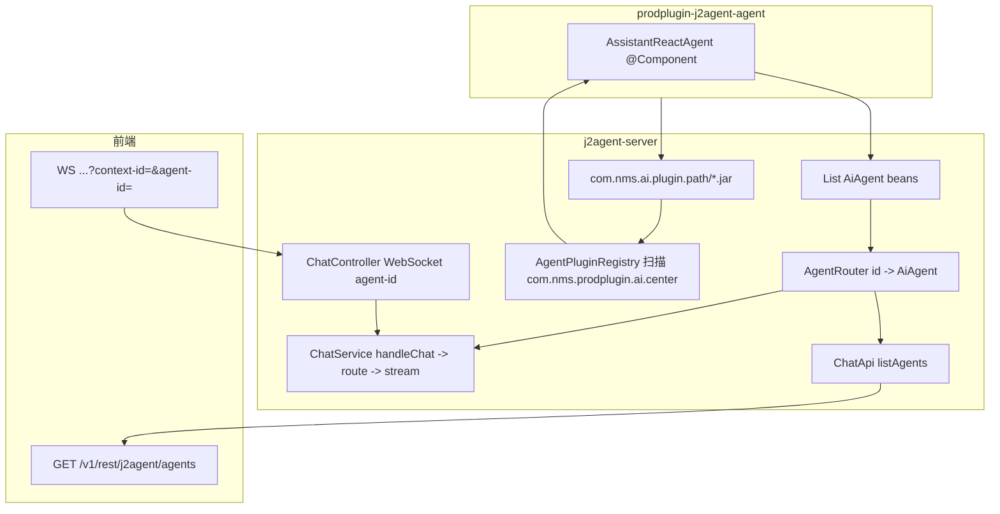

# 插件智能体接入与界面展示机制（以聊天助手为例）

本文固化 **prodplugin-j2agent-agent** 中 `AssistantReactAgent`（及同包其它 `AiAgent`）如何进入 **j2agent-server** 运行时，并经由 **HTTP 列表 + WebSocket 对话** 暴露给前端的完整链路。实现上并非「界面直连插件」，而是 **插件 JAR 放入 `com.nms.ai.plugin.path` → `AgentPluginRegistry` 扫描注册 Bean → 路由器聚合 → REST/WebSocket 协议**。

> **开发者文档**：如何编写 Agent、注册 Tool / Skill / MCP 等平台能力，见 [agent开发/](agent开发/README.md)。

## 1. 总览

## 2. 插件 JAR 加载（插件类进入 Spring 容器）

| 环节 | 说明 |
|------|------|
| 部署 | 将各业务插件模块打成的 JAR 放入配置项 **`com.nms.ai.plugin.path`** 目录（如 `/opt/j2agent/volume/plugins/agents`）。 |
| 注册 | **`AgentPluginRegistry`** 扫描 JAR 内 **`com.nms.prodplugin.ai.center`** 包下全部 Spring 组件（`@Component` 等），注册 BeanDefinition 后先实例化依赖 Bean，再实例化 `AiAgent`；支持运行时热重载。 |

插件内的 `AssistantReactAgent` 声明为 `@Component` 并继承平台侧的 `agent.llm.service.io.github.jerryt92.j2agent.AiAgent`；`@PostConstruct` 时在 `AiAgent` 基类中完成底层 Alibaba `ReactAgent` 的构建（模型、记忆、工具拦截器等见基类实现）。

## 3. Bean 聚合与路由

- Spring 会注入 **`List<AiAgent>`**，收集容器中所有 `AiAgent` 实现（含插件中的 `AssistantReactAgent`、`IntelligentReportAgent` 等）。
- **`AgentRouter`** 在构造时将列表转为 **`Map<String, AiAgent>`**，键为各实现 **`getAgentId()`** 的返回值，值为实现本身。
- **`route(String agentId)`**：
  - 将历史别名 **`assistant` 映射为 `chat_assistant`**，与 `AssistantReactAgent#getAgentId()` 对齐。
  - 未知 `agentId` 抛出 `IllegalArgumentException`（不支持该智能体）。

聊天助手在插件中的约定标识：

- **`getAgentId()`**：`chat_assistant`
- **`getAgentName()` / `getAgentDescription()`**：供列表与卡片展示文案。
- **`getSort()`**：基类默认 100；助手覆盖为 **1**（当前 `listRegisteredAgents` 按 **agentId 字符串**排序，**未使用** `getSort()`；若前端要按业务优先级排序，需在接口或前端单独约定）。
- **`getThinkingOverride()`**（可选）：Agent 级默认深度思考策略；默认 `USE_PROVIDER_DEFAULT`。单轮可被 WebSocket 消息体 `ChatRequestDto.thinkingMode` 覆盖（优先级更高）。

## 4. HTTP：列出已注册智能体（界面卡片/下拉数据源）

- **实现**：`ChatController#listAgents` 委托 `agentRouter.listRegisteredAgents()`。
- **行为**：遍历已注册的 `AiAgent`，映射为 `AgentInfoDto`（`agentId`、`name`、`description`、`showHotQuestions`），按 **`agentId` 字典序**排序后封装为 `AgentInfoList`。
- **OpenAPI**：`GET /v1/rest/j2agent/agents`，`operationId: listAgents`（见 `j2agent-model` 中 `openapi-interface.yaml`）。

前端典型用法：启动或进入聊天页时请求该接口，用返回的 **`agentId`** 作为后续 WebSocket 与历史接口的 **`agent-id`**。

## 5. WebSocket：选中智能体后的对话通道

- **路径**：`/ws/rest/j2agent/chat`（见 `ChatController` 上 `@AutoRegisterWebSocketHandler`）。
- **查询参数**（连接建立时解析）：
  - **`context-id`**：业务会话上下文 ID，必填。
  - **`agent-id`**：与 `getAgentId()` 一致（如聊天助手为 **`chat_assistant`**），必填；缺失时服务端下发失败态事件并关闭连接。
- **会话属性**：`agentId` 存入 WebSocket session，随后在 **`handleTextMessage`** 中随 `ChatRequestDto` 一并交给 **`ChatService#handleChat(..., agentId)`**。
- **运行时选择**：`ChatService` 内 **`agentRouter.route(agentId)`** 得到具体 `AiAgent`，再按 [Agent 对话记录机制](../agent对话记录/README.md) 组装 **`conversationId = userId:contextId:agentId`** 与 **`AgentRunContext`**，调用 **`AiAgent#stream`**。

因此：**界面展示的「选中的智能体」必须落到连接上的 `agent-id` 与每条业务会话的 context**，才能保证记忆与历史与 `AgentRouter` 中的键一致。

## 6. 与「Agent-UI 事件协议」的关系

对话过程中，工具与状态机事件由 `ChatService` 与 `AiAgent` 侧拦截器（如 `AgentUiToolEventInterceptor`）统一产出 **`AgentUiEventEnvelope`**，经 WebSocket 推送给前端；协议与状态机约定见 [Agent-UI 交互机制](../agent-ui交互机制/README.md)。  
聊天助手通过继承 **`AiAgent`** 自动挂载默认拦截器链；**不**等同于「单独的前端加载器」，而是同一套 WS 事件流。

## 7. MCP 刷新与 Agent 重建

容器中全部 `AiAgent` Bean 会监听 **`McpToolCallbacksRefreshedEvent`**，在 MCP 工具回调更新后执行 **`rebuildAgent()`**（见 `McpToolCallbacksRefreshedListener`）。聊天助手在 `buildToolCallbacks()` 中合并 `BaseTools` 与 MCP，因此该机制会同步刷新其运行时图。

## 8. 新增插件内 Agent 时的检查清单

开发细节（Tool / Skill / MCP / RAG 等）见 [agent开发/README.md 验证清单](agent开发/README.md#验证清单)。接入侧最小检查：

1. 类在 **`com.nms.prodplugin.ai.center`** 包下，`@Component` + **`extends AiAgent`**；**`getAgentId()`** 全局唯一。
2. JAR 部署到 **`com.nms.ai.plugin.path`**，启动或 **`POST /v1/rest/j2agent/agents/reload`** 后确认 `loadedAgentIds` 含新 id。
3. 前端列表与 WebSocket / 历史接口使用同一 **`agent-id`**（见 [Agent 对话记录机制](../agent对话记录/README.md)）。
4. 若需兼容旧客户端字符串，在 **`AgentRouter#route`** 增加别名映射（已有 `assistant` → `chat_assistant`）。

## 9. 关键代码位置索引

| 主题 | 路径（仓库内相对 j2agent） |
|------|----------------------------------------|
| 插件聊天助手 | 独立仓库 **prodplugin-j2agent-agent**：`.../agents/assistant/AssistantReactAgent.java` |
| 插件注册与热加载 | `j2agent-server/.../service/llm/agent/AgentPluginRegistry.java` |
| 路由与列表 | `j2agent-server/.../service/llm/agent/AgentRouter.java` |
| Agent 基类与 stream | `j2agent-server/.../service/llm/agent/AiAgent.java` |
| 热门问题模板 | 插件 JAR 内 `qa-template.json` + `AiAgent#isQaTemplateEnabled()`；`QaTemplateController` |
| 对话编排 | `j2agent-server/.../service/llm/ChatService.java` |
| WebSocket 与 listAgents | `j2agent-server/.../controller/ChatController.java` |

---

**文档版本说明**：与当前代码结构一致；若后续将「列表排序」改为使用 `getSort()` 或增加图标等展示字段，需同步更新第 3、4 节与 OpenAPI 模型。
