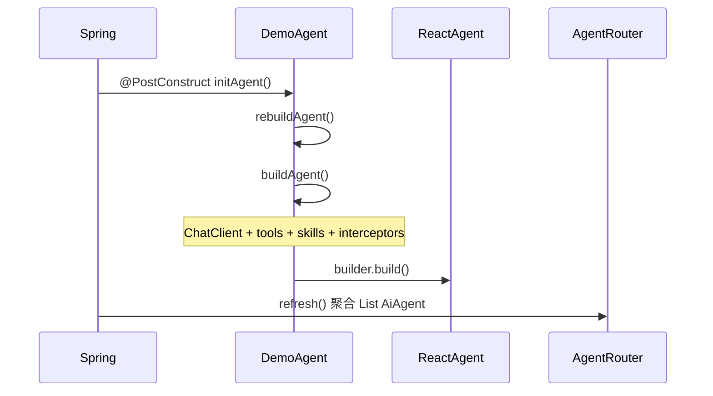

# Agent 开发

本文说明如何继承平台基类 `AiAgent`、实现插件 Agent，并完成部署与热重载。

## 1. 核心契约

`AiAgent` 位于 `agent.llm.service.io.github.jerryt92.j2agent.AiAgent`，基于 **Spring AI Alibaba `ReactAgent`** 封装对话、记忆、工具、Skill、RAG 等能力。

### 1.1 必须实现的抽象方法

| 方法 | 说明 |
|------|------|
| `getAgentId()` | 全局唯一标识；与 WebSocket `agent-id`、DB/Redis 中 `agent_id` 一致 |
| `getAgentName()` | 智能体展示名称（`GET /agents` 列表） |
| `getAgentDescription()` | 智能体描述文案 |
| `loadSystemPrompt()` | 系统提示词；可从 classpath 读取或直接返回字符串 |

### 1.2 可选 override

| 方法 | 默认 | 说明 |
|------|------|------|
| `getSort()` | `100` | 业务排序权重（当前列表 API 按 `agentId` 字典序，未消费此字段） |
| `getThinkingOverride()` | `USE_PROVIDER_DEFAULT` | Agent 级深度思考默认策略；见 [可选能力.md](可选能力.md) |
| `isQaTemplateEnabled()` | `false` | 是否启用热门问题模板 |
| `buildTools()` | 空数组 | 挂载 `@Tool` 工具 Bean |
| `buildSkillNames()` | 空集合 | 启用 Skill 的 id 列表 |
| `buildDocumentRetriever()` | `null` | RAG 检索器 |
| `buildToolCallbacks()` | 由 `buildTools()` 转换 | 需合并 MCP 时 override |
| `buildInterceptors()` | 工具 UI + Skill UI 拦截器 | 可扩展；工具异常兜底始终保留 |

## 2. 最小示例

```java
package com.nms.prodplugin.ai.center.demo;

import agent.llm.service.io.github.jerryt92.j2agent.AiAgent;
import org.springframework.stereotype.Component;

import java.io.InputStream;
import java.nio.charset.StandardCharsets;

@Component
public class DemoAgent extends AiAgent {

    @Override
    public String getAgentId() {
        return "demo_agent";
    }

    @Override
    public String getAgentName() {
        return "演示 Agent";
    }

    @Override
    public String getAgentDescription() {
        return "最小接入示例，用于验证插件加载与对话链路。";
    }

    @Override
    public String loadSystemPrompt() {
        try (InputStream in = getClass().getClassLoader()
                .getResourceAsStream("system-prompt.md")) {
            if (in != null) {
                return new String(in.readAllBytes(), StandardCharsets.UTF_8);
            }
        } catch (Exception ignored) {
            // fallback
        }
        return "你是演示助手，回答应简洁准确。";
    }
}
```

`src/main/resources/system-prompt.md`（可选）：

```markdown
你是演示助手。
- 回答使用中文。
- 不确定时明确说明，不要编造。
```

## 3. 生命周期



1. **Bean 实例化**：`AgentPluginRegistry` 在 `ApplicationReadyEvent` 后先实例化插件内依赖 Bean，再实例化 `AiAgent`（保证工具类等已就绪）。
2. **`@PostConstruct`**：调用 `rebuildAgent()` → `buildAgent()` 组装底层 `ReactAgent`。
3. **路由注册**：`AgentRouter.refresh()` 将所有 `AiAgent` Bean 按 `getAgentId()` 放入 Map；重复 id 抛 `IllegalStateException`。
4. **MCP 变更**：监听 `McpToolCallbacksRefreshedEvent`，全部 Agent 执行 `rebuildAgent()`（仅对 override 了 MCP 合并的 Agent 生效）。

对话入口：`ChatService` → `agentRouter.route(agentId)` → `AiAgent.stream(AgentRunContext)`。

## 4. 插件约束

### 4.1 包与类加载

| 约束 | 说明 |
|------|------|
| 包名 | **`com.nms.prodplugin.ai.center`** 及子包 |
| 平台类 | `io.github.jerryt92.j2agent.*` 由 `PluginAgentClassLoader` **委托父 ClassLoader** 加载 |
| 禁止重复打包 | 插件 JAR **不得**包含平台类，否则可能类加载冲突 |
| 依赖 Bean | 工具、Retriever 等同 JAR 类须带 Spring 注解且在同一扫描包下 |

### 4.2 agentId 唯一性

- 插件 Agent 之间、插件与内置 Agent 之间 **`getAgentId()` 不可重复**。
- 启动与 `POST /agents/reload` 均会校验；冲突时整次 reload 失败。

### 4.3 历史别名（可选）

若需兼容旧客户端字符串，在平台侧 `AgentRouter#route` 增加映射（如已有 `assistant` → `chat_assistant`）。新 Agent 建议使用稳定的新 id，避免依赖别名。

## 5. 部署与热重载

### 5.1 配置

```yaml
com:
  nms:
    ai:
      plugin:
        path: ${user.home}/j2agent/plugins/agents
```

### 5.2 管理 API（需 ADMIN 角色）

| 接口 | 说明 |
|------|------|
| `GET /v1/rest/j2agent/plugins/agents` | 返回 JAR 列表、已加载 `agentId` |
| `POST /v1/rest/j2agent/agents/reload` | 重新扫描目录并注册 Agent |

典型日志关键字：

- `Registered dynamic plugin bean definition`
- `Loaded plugin agent: demo_agent`

### 5.3 验证

见 [README.md 验证清单](README.md#验证清单)。

## 6. 平台代码索引

| 主题 | 路径 |
|------|------|
| Agent 基类 | `j2agent-server/.../service/llm/agent/AiAgent.java` |
| 插件注册 | `.../service/llm/agent/AgentPluginRegistry.java` |
| 类加载器 | `.../service/llm/agent/PluginAgentClassLoader.java` |
| 路由 | `.../service/llm/agent/AgentRouter.java` |
| MCP 重建监听 | `.../service/llm/agent/McpToolCallbacksRefreshedListener.java` |
| 对话编排 | `.../service/llm/ChatService.java` |

## 7. 相关文档

- [README.md](README.md) — 快速入门与工程骨架
- [工具.md](工具.md) — 挂载 Tool
- [Skill.md](Skill.md) — 挂载 Skill
- [MCP.md](MCP.md) — 挂载 MCP
- [可选能力.md](可选能力.md) — RAG、热门问题、深度思考
- [插件智能体接入与界面](../README.md) — 前端暴露链路
