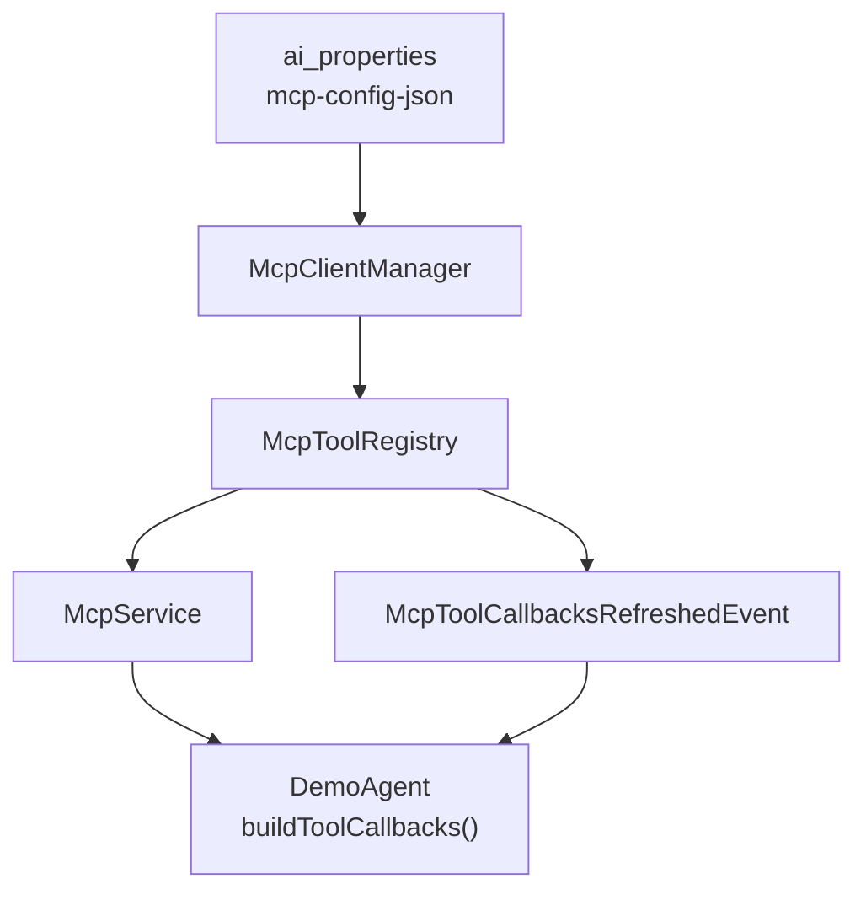

# MCP 接入

本文说明如何在平台中配置 **MCP（Model Context Protocol）Server**，并在插件 Agent 中合并 MCP 工具。

**重要**：基类 `AiAgent` **不会**自动挂载 MCP。开发者须在子类 **override `buildToolCallbacks()`** 追加 `McpService` 提供的回调。

MCP 配置与 LLM 提供商配置**分离**（`useMcpTools` 已从 LLM 配置移除），见 [LLM 提供商配置](../../LLM提供商配置/README.md)。

## 1. 架构概览



1. MCP Server 连接信息持久化在 DB。
2. `McpClientManager` 建立 stdio / SSE / streamable HTTP 连接。
3. `McpToolRegistry` 生成 `SyncMcpToolCallbackProvider`。
4. Agent 在 `buildToolCallbacks()` 中合并 MCP 与本地 `@Tool`。
5. 配置或连接变更时发布事件，触发全部 Agent `rebuildAgent()`。

## 2. 配置存储

| 项 | 值 |
|----|-----|
| 存储表 | `ai_properties` |
| 属性名 | `mcp-config-json` |
| 管理 API | `GET/PUT /v1/rest/j2agent/mcp/config`（ADMIN） |
| 状态 API | `GET /v1/rest/j2agent/mcp/status`（ADMIN） |

## 3. JSON 结构

根对象含 **`mcpServers`**，键为 server 名称（自定义），值为连接参数：

```json
{
  "mcpServers": {
    "filesystem-local": {
      "command": "npx",
      "args": ["-y", "@modelcontextprotocol/server-filesystem", "/tmp"],
      "env": {}
    },
    "remote-sse": {
      "type": "sse",
      "url": "http://localhost:8080",
      "sseEndpoint": "/sse",
      "headers": {
        "Authorization": "Bearer YOUR_TOKEN"
      }
    },
    "remote-streamable": {
      "type": "streamable_http",
      "url": "https://mcp.example.com",
      "endpoint": "/mcp",
      "headers": {}
    }
  }
}
```

### 3.1 传输类型

| `type` | 说明 | 主要字段 |
|--------|------|----------|
| （省略） | **stdio** 子进程 | `command`、`args`、`env` |
| `sse` | Server-Sent Events | `url`、`sseEndpoint`（默认 `/sse`）、`headers` |
| `streamable_http` | Streamable HTTP | `url`、`endpoint`（默认 `/mcp`）、`headers` |

保存配置后平台会自动 `reloadAll()` 并重连。

## 4. Agent 侧接入

```java
package com.nms.prodplugin.ai.center.demo;

import io.github.jerryt92.j2agent.service.llm.agent.AiAgent;
import io.github.jerryt92.j2agent.service.llm.mcp.McpService;
import lombok.RequiredArgsConstructor;
import org.springframework.ai.support.ToolCallbacks;
import org.springframework.ai.tool.ToolCallback;
import org.springframework.stereotype.Component;

import java.util.ArrayList;
import java.util.Arrays;
import java.util.List;

@Component
@RequiredArgsConstructor
public class DemoAgent extends AiAgent {

    private final McpService mcpService;
    private final DemoTools demoTools;

    @Override
    protected Object[] buildTools() {
        return new Object[] { demoTools };
    }

    @Override
    protected ToolCallback[] buildToolCallbacks() {
        List<ToolCallback> all = new ArrayList<>();
        // 1. 本地 @Tool
        all.addAll(Arrays.asList(super.buildToolCallbacks()));
        // 2. MCP 工具（全局共享，按 Agent 按需合并）
        ToolCallback[] mcpCallbacks = mcpService.getToolCallbackProvider().getToolCallbacks();
        if (mcpCallbacks != null) {
            all.addAll(Arrays.asList(mcpCallbacks));
        }
        return all.stream().filter(c -> c != null).toArray(ToolCallback[]::new);
    }
}
```

**设计说明**：

- MCP 工具在运行时**全局注册**，但是否暴露给模型由**各 Agent 的 `buildToolCallbacks()`** 决定。
- 不需要 MCP 的 Agent 不要合并，避免模型调用无关外部工具。
- 合并后 MCP 配置变更会通过 `McpToolCallbacksRefreshedListener` 触发 `rebuildAgent()`，无需重启服务。

## 5. 刷新链路

```
PUT /mcp/config 或 McpService.reload()
  → McpClientManager.reloadAll()
  → McpToolRegistry.refreshToolCallbacks()
  → McpToolCallbacksRefreshedEvent
  → AiAgentReloadService.reloadAll()
  → 每个 AiAgent.rebuildAgent()
```

## 6. 排错

| 步骤 | 操作 |
|------|------|
| 查看连接状态 | `GET /v1/rest/j2agent/mcp/status` — 各 server `online`/`offline` 及工具列表 |
| 查看配置 | `GET /v1/rest/j2agent/mcp/config` |
| 查看日志 | 关键字 `MCP server connected` / `MCP server connect failed` |
| 模型调不到 MCP 工具 | 确认 Agent override 了 `buildToolCallbacks()` 且 merge 了 `McpService` |
| 工具名冲突 | MCP 工具名与本地 `@Tool` 重名会导致模型混淆，调整 MCP server 或本地工具名 |

**错误语义**：MCP 工具调用失败通常为可恢复错误（`eventType=TOOL` + `phase=ERROR`，状态回到 `THINKING`），**不会**触发整轮 `FAILED`。见 [Agent-UI 交互机制 3.5](../../agent-ui交互机制/README.md)。

## 7. 平台代码索引

| 主题 | 路径 |
|------|------|
| MCP 服务入口 | `.../service/llm/mcp/McpService.java` |
| 连接管理 | `.../service/llm/mcp/McpClientManager.java` |
| 工具回调注册 | `.../service/llm/mcp/McpToolRegistry.java` |
| Agent 重建监听 | `.../service/llm/agent/McpToolCallbacksRefreshedListener.java` |
| 管理接口 | `.../controller/McpController.java` |

## 8. 相关文档

- [工具.md](工具.md) — 本地 Tool 与 MCP 合并
- [Agent开发.md](../../../../prodplugin-j2agent-agents/docs/Agent开发.md) — Agent 生命周期
- [插件智能体接入与界面](../README.md) — MCP 刷新与 Agent 重建（§7）
- [LLM 提供商配置](../../LLM提供商配置/README.md) — MCP 与 LLM 配置分离说明
