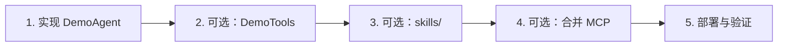

# Agent 开发指南（快速入门）

本文面向**在插件 JAR 中实现业务 Agent** 的后端开发者，说明如何编写 Agent、挂载工具 / Skill / MCP 等平台能力，并完成部署验证。

插件进入运行时后的 **HTTP 列表、WebSocket 对话、前端暴露链路** 见父文档 [插件智能体接入与界面](../README.md)。本文聚焦**开发侧**。

## 文档索引

| 文档 | 说明 |
|------|------|
| [Agent开发.md](../../../../j2agent-plugins-agents/docs/Agent开发.md) | `AiAgent` 契约、生命周期、插件约束、热重载（插件仓库） |
| [工具.md](工具.md) | `@Tool` 编写、平台内置工具、`buildTools()` |
| [Skill.md](Skill.md) | `skills/` 目录、`buildSkillNames()`、`read_skill` |
| [MCP.md](MCP.md) | MCP 配置、Agent 侧合并、刷新与排错 |
| [可选能力.md](可选能力.md) | RAG、热门问题、深度思考、自定义拦截器 |

## 1. 前置条件

| 项 | 说明 |
|----|------|
| JDK | 21（与平台 `j2agent-server` 一致） |
| 包名 | 插件类必须在 **`com.nms.prodplugin.ai.center`** 及其子包（`AgentPluginRegistry` 硬编码扫描） |
| Spring 注解 | Agent 及同 JAR 依赖须 `@Component` / `@Service` 等 |
| 部署目录 | `j2agent.plugin.path`，默认 `${user.home}/j2agent/plugins/agents` |
| 平台依赖 | 插件模块依赖 `j2agent-server`（编译期）；**不可**将平台类打入插件 JAR |

## 2. 最小工程骨架

每个 Agent 是**独立 Maven 工程**（一 Agent 一目录、可单独 `mvn package`）。**推荐复制** [`0_example-agent`](../../../../j2agent-plugins-agents/agents/0_example-agent/) 目录作为起点；**不必**继承本仓库 [`agents/pom.xml`](../../../../j2agent-plugins-agents/agents/pom.xml)（该聚合 POM 仅用于本仓库一键编译）。

```
0_example-agent/                # 复制此目录并重命名
  pom.xml
  src/main/resources/system-prompt.md
  src/main/assemblies/agent-package.xml
  src/main/java/.../ExampleAgent.java
  # 按需扩展：
  # DemoTools.java
  # src/main/resources/skills/demo-skill/SKILL.md
  # src/main/resources/qa-template.json
```

**`pom.xml` 片段**（独立工程，自行声明依赖版本与打包插件）：

```xml
<project>
  <modelVersion>4.0.0</modelVersion>
  <groupId>com.nms.prodplugin.ai.center</groupId>
  <artifactId>my-agent-plugin</artifactId>
  <version>1.0.0-SNAPSHOT</version>
  <packaging>jar</packaging>
  <properties>
    <maven.compiler.source>21</maven.compiler.source>
    <maven.compiler.target>21</maven.compiler.target>
  </properties>
  <dependencies>
    <dependency>
      <groupId>io.github.jerryt92.j2agent</groupId>
      <artifactId>j2agent-server</artifactId>
      <version>1.0.2-agent-SNAPSHOT</version>
      <scope>provided</scope>
    </dependency>
    <dependency>
      <groupId>org.projectlombok</groupId>
      <artifactId>lombok</artifactId>
      <version>1.18.32</version>
      <scope>provided</scope>
    </dependency>
  </dependencies>
  <build>
    <plugins>
      <plugin>
        <groupId>org.apache.maven.plugins</groupId>
        <artifactId>maven-jar-plugin</artifactId>
        <configuration>
          <excludes><exclude>com/nms/platsvc/**</exclude></excludes>
        </configuration>
      </plugin>
      <plugin>
        <groupId>org.apache.maven.plugins</groupId>
        <artifactId>maven-assembly-plugin</artifactId>
      </plugin>
    </plugins>
  </build>
</project>
```

`mvn package` → **`target/<artifactId>-<version>/`** 与 **`target/<artifactId>-<version>.tar.gz`**（内容一致）。详见 [j2agent-plugins-agents/README.md](../../../../j2agent-plugins-agents/README.md)。

## 3. 五步入门流程



1. **实现 Agent**：`DemoAgent extends AiAgent` + `@Component`，实现 `getAgentId()` 等抽象方法 → 见 [Agent开发.md](../../../../j2agent-plugins-agents/docs/Agent开发.md)
2. **（可选）注册工具**：同 JAR 内 `@Tool` 工具类，在 `buildTools()` 中返回 → 见 [工具.md](工具.md)
3. **（可选）挂载 Skill**：`resources/skills/<id>/SKILL.md` + override `buildSkillNames()` → 见 [Skill.md](Skill.md)
4. **（可选）合并 MCP**：override `buildToolCallbacks()` 追加 `McpService` 回调 → 见 [MCP.md](MCP.md)
5. **部署验证**：`mvn package` → 复制 `target/<artifact>-<version>/` 或解压 tar.gz 到 plugin path 子目录 → 调用验证接口（见下节）

## 4. 能力选型

| 能力 | 适用场景 | 开发者动作 |
|------|----------|------------|
| **Tool** | 模型需即时调用、有明确入参出参的函数（查时间、调 API、算数） | `@Tool` + `buildTools()` |
| **Skill** | 长文档、流程说明、领域知识；按需加载，减少 system prompt 体积 | `skills/<id>/SKILL.md` + `buildSkillNames()` |
| **MCP** | 复用外部 MCP Server 工具集（文件系统、浏览器、第三方 SaaS） | 管理端配置 JSON + Agent override `buildToolCallbacks()` |
| **RAG** | 基于 Milvus 知识库的向量检索增强 | `buildDocumentRetriever()` → 见 [可选能力.md](可选能力.md) |

Tool 与 Skill 可并存：Tool 负责「执行」，Skill 负责「告知怎么做」。

## 5. 验证清单 {#验证清单}

| 步骤 | 操作 | 期望结果 |
|------|------|----------|
| 打包 | 在 Agent 工程目录 `mvn -q clean package` | `target/<artifact>-<version>/` + `.tar.gz` |
| 部署 | `mkdir` 后复制 agent-package 或 `tar -xzf -C` 目标子目录 | 每 Agent 占 plugin.path 下一级子目录 |
| 启动/重载 | 重启服务，或 `POST /v1/rest/j2agent/agents/reload`（ADMIN） | 日志含 `Loaded plugin agent`；reload 返回 `success: true` |
| 插件状态 | `GET /v1/rest/j2agent/plugins/agents` | `loadedAgentIds` 含你的 `getAgentId()` |
| 列表 | `GET /v1/rest/j2agent/agents` | 返回体含 `agentId`、`name`、`description` |
| 对话 | WebSocket `/ws/rest/j2agent/chat?context-id=xxx&agent-id=<你的id>` | 能正常收发消息；工具调用出现 `CALLING_TOOL` 状态 |
| agentId 唯一 | 两个 JAR 使用相同 `getAgentId()` | 启动或 reload **失败**，提示冲突 |

完整 Agent 契约与约束见 [Agent开发.md](../../../../j2agent-plugins-agents/docs/Agent开发.md)；前端对接见 [Agent 对话记录机制](../../agent对话记录/README.md)。

## 6. 相关文档

- [插件智能体接入与界面](../README.md) — 运行时接入与 UI 暴露
- [Agent-UI 交互机制](../../agent-ui交互机制/README.md) — WebSocket 状态机与工具事件
- [Agent 对话记录机制](../../agent对话记录/README.md) — `conversationId` 与记忆
- [RAG 机制](../../RAG机制/README.md) — 知识库与检索
- [LLM 提供商配置](../../LLM提供商配置/README.md) — 模型与深度思考默认值
