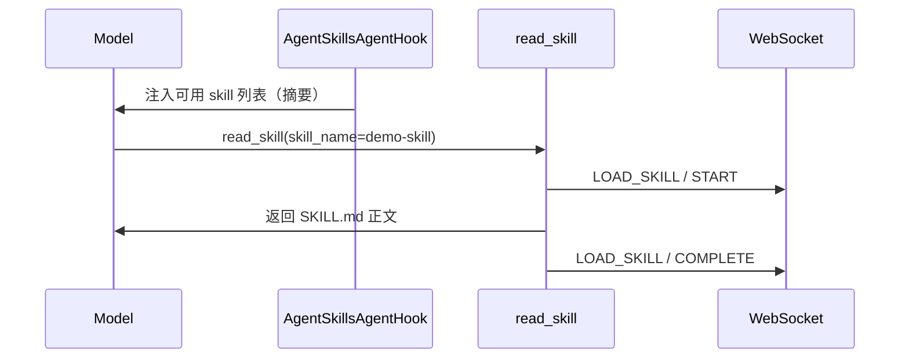

# Skill 开发

本文说明如何为插件 Agent 挂载 **Skill（技能）**——基于 Alibaba Agent Framework 的渐进式披露机制，模型通过 `read_skill` 按需加载 Markdown 正文。

## 1. Skill 与 Tool 的区别

| 维度 | Tool | Skill |
|------|------|-------|
| 内容形态 | 可执行函数（入参 → 出参） | Markdown 文档（流程、领域知识） |
| 加载方式 | 模型直接 `call` | 模型先看到技能列表，再 `read_skill` 读正文 |
| 上下文占用 | 仅 tool schema | 按需加载，减少 system prompt 体积 |
| UI 状态 | `CALLING_TOOL` | `LOAD_SKILL` |
| 开发者动作 | `@Tool` + `buildTools()` | `skills/` 资源 + `buildSkillNames()` |

两者可并存：Skill 描述「怎么做」，Tool 负责「执行」。

## 2. 启用方式

在 Agent 子类 override **`buildSkillNames()`**，返回 skill id 集合（对应 `skills/` 下的目录名）：

```java
import java.util.Set;

@Override
protected Set<String> buildSkillNames() {
    return Set.of("demo-skill");
}
```

基类 `buildAgent()` 会在 skill 集合非空时挂载 `AgentSkillsAgentHook`，并注册 `read_skill` 工具。

## 3. 资源布局

文件放在插件 JAR 的 **`src/main/resources/skills/`** 下（由 Agent 的 ClassLoader 加载）：

```
src/main/resources/skills/
  demo-skill/
    SKILL.md              # 必需：技能主文档
    附属说明.md            # 可选：补充 .md
```

| 路径 | 说明 |
|------|------|
| `skills/<skillId>/SKILL.md` | 技能根文档；`<skillId>` 须与 `buildSkillNames()` 中的 id 一致 |
| `skills/<skillId>/*.md` | 附属文档，通过 `read_skill` 的 `relative_path` 加载 |

JAR 内资源由 `AgentClassLoaderSkillRegistry` 解压到临时目录后供扫描器读取。

## 4. SKILL.md 格式

支持 **YAML frontmatter**（Alibaba `SkillScanner` 标准）。`read_skill` 默认返回**去掉 frontmatter 后的正文**。

```markdown
---
name: demo-skill
description: 演示技能，说明如何处理演示类问题。
---

# 演示技能

当用户询问「演示流程」时，按以下步骤回答：

1. 确认用户目标
2. 列出必要前置条件
3. 给出分步操作说明

## 注意事项

- 不要编造不存在的功能
- 涉及权限操作时提醒用户确认
```

附属文档示例 `skills/demo-skill/FAQ.md`：

```markdown
# 常见问题

## 如何重置演示环境？

联系管理员执行环境重置脚本。
```

## 5. 运行时行为



- **`AgentSkillsAgentHook`**：向模型上下文注入已注册 skill 的元数据列表。
- **`AgentReadSkillTool`**：统一 `read_skill` 实现。
  - 省略 `relative_path`：读取 `SKILL.md`（无 frontmatter）
  - 指定 `relative_path`：读取技能目录下其它 `.md`（不允许 `..`）
- **`AgentUiSkillLoadToolInterceptor`**：驱动 UI `LOAD_SKILL` 状态与审计入库。

`read_skill` 参数约定（模型侧）：

| 参数 | 说明 |
|------|------|
| `skill_name` / `skillName` | 必填，须匹配 `buildSkillNames()` 中的 id |
| `relative_path` / `relativePath` | 可选，如 `FAQ.md` |

UI 与审计细节见 [Agent-UI 交互机制 3.4](../../agent-ui交互机制/README.md)。

## 6. 完整 Agent 片段

```java
@Component
public class DemoAgent extends AiAgent {

    @Override
    protected Set<String> buildSkillNames() {
        return Set.of("demo-skill");
    }

    // 可同时挂载 Tool：
    // @Override protected Object[] buildTools() { ... }
}
```

## 7. 常见问题

| 现象 | 排查 |
|------|------|
| 模型从不调用 `read_skill` | 检查 system prompt 是否引导使用技能；skill `description` 是否清晰 |
| `read_skill` 报 skill 不存在 | `buildSkillNames()` 的 id 与目录名不一致；JAR 内缺少 `SKILL.md` |
| 附属 .md 读不到 | `relative_path` 路径须在技能目录内，且以 `.md` 结尾 |
| UI 无 LOAD_SKILL | 确认继承 `AiAgent` 且未移除 `AgentUiSkillLoadToolInterceptor` |

## 8. 平台代码索引

| 主题 | 路径 |
|------|------|
| `buildSkillNames` | `.../service/llm/agent/AiAgent.java` |
| Skill 注册表 | `.../service/llm/skill/AgentClassLoaderSkillRegistry.java` |
| Skills Hook | `.../service/llm/skill/AgentSkillsAgentHook.java` |
| read_skill 实现 | `.../service/llm/skill/AgentReadSkillTool.java` |
| Skill UI 拦截器 | `.../service/llm/skill/AgentUiSkillLoadToolInterceptor.java` |

## 9. 相关文档

- [工具.md](工具.md) — Tool 开发与 UI 事件
- [Agent开发.md](Agent开发.md) — Agent 基类
- [Agent-UI 交互机制](../../agent-ui交互机制/README.md) — `LOAD_SKILL` 状态机
- [Spring AI Alibaba Skills 教程](https://java2ai.com/docs/frameworks/agent-framework/tutorials/skills) — 上游框架说明
